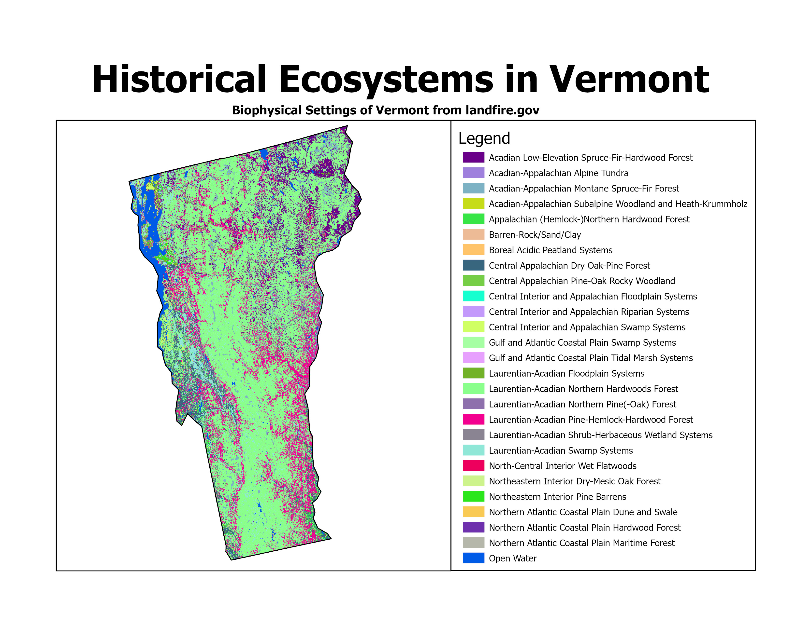
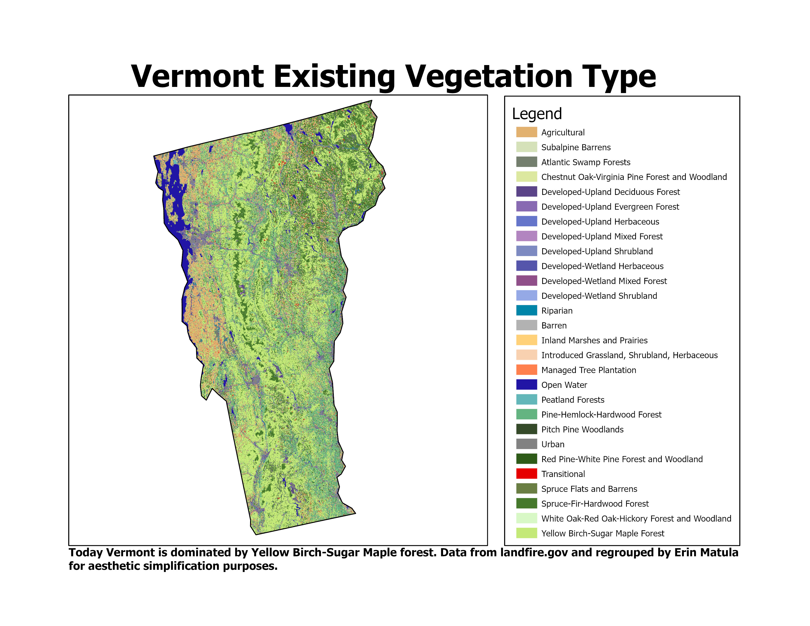
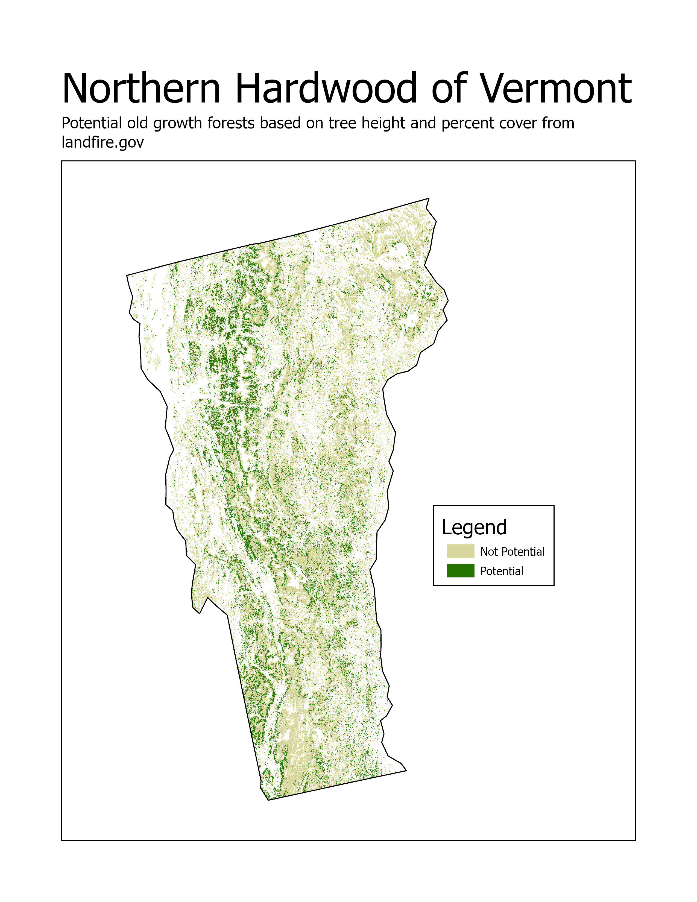

```{r setup, include=FALSE}
knitr::opts_chunk$set(echo = TRUE)
library(flexdashboard)
library(tidyverse)
```

```{r include=FALSE}
bps_sclass_practice <- read_csv("bps_sclass.csv")
nhheat <- read_csv("nh_heat.csv")
theme_set(theme_bw())
```


Background
=========================================

## Kowalski Analysis

```{r, echo=FALSE, out.width="100%"}
knitr::include_graphics("outcrop.jpg")
```


```{r, echo=FALSE, out.width="100%"}
knitr::include_graphics("hardwood.jpg")
```


```{r, echo=FALSE, out.width="100%"}
knitr::include_graphics("hardwood2.jpg")
```

Column {.sidebar}
-----------------------------------------------------------------------
<b><font  size="4em" color="#000000">What is LANDFIRE?</font></b>  

Conservation challenges transcend political boundaries, and/or require many datasets which makes conservation planning a challenge.  Many freely available vegetation datasets are state-based, only cover one attribute of vegetation (e.g., type but not height) or are incompatible.  In the United States the [LANDFIRE program](https://landfire.gov/) delivers over two dozen datasets that characterize vegetation, fire and fuel characteristics for all lands.  

**Using LANDFIRE data we:**

* made maps of Vermont's ecosystems past and present
* identified potential areas of old-growth northern hardwoods
* explored utility, and challenges of using LANDFIRE data


Past
=========================================

## Kowalski Analysis

```{r, echo=FALSE, out.width="100%"}

```
 


Column {.sidebar}
-----------------------------------------------------------------------
<b><font  size="4em" color="#000000">Precolonialization</font></b>  

The FitnessGram™ Pacer Test is a multistage aerobic capacity test that progressively gets more difficult as it continues. The 20 meter pacer test will begin in 30 seconds. Line up at the start. The running speed starts slowly, but gets faster each minute after you hear this signal. [beep] A single lap should be completed each time you hear this sound. [ding] Remember to run in a straight line, and run as long as possible. The second time you fail to complete a lap before the sound, your test is over. The test will begin on the word start. On your mark, get ready, start.

**The goals of this thing are:**


Present
=========================================

## Kowalski Analysis

```{r, echo=FALSE, out.width="100%"}

```
 

Column {.sidebar}
-----------------------------------------------------------------------
<b><font  size="4em" color="#000000">Current</font></b>  

The FitnessGram™ Pacer Test is a multistage aerobic capacity test that progressively gets more difficult as it continues. The 20 meter pacer test will begin in 30 seconds. Line up at the start. The running speed starts slowly, but gets faster each minute after you hear this signal. [beep] A single lap should be completed each time you hear this sound. [ding] Remember to run in a straight line, and run as long as possible. The second time you fail to complete a lap before the sound, your test is over. The test will begin on the word start. On your mark, get ready, start.

**The goals of this thing are:**
```{r}
#library(readr)
#bps_sclass_practice <- #read_csv("C:/Users/ematula/Desktop/Vermont/thingy/bps_sclass.csv")
#selectInput('xcol', 'X Variable', names(bps_sclass_practice))
    
#selectInput('ycol', 'Y Variable', names(bps_sclass_practice),
#                selected=names(bps_sclass_practice)[[2]])
    

```

    
    
```{r, echo=FALSE, out.width="100%"}

# need to make longer
bps_sclass_practice <- bps_sclass_practice %>%
  pivot_longer(
    cols = c(`Reference`, `Current`), 
    names_to = "refCur", 
    values_to = "Percent"
  )

bps_sclass_practice$Sclass <- factor(bps_sclass_practice$Sclass, levels = c(
  "Early Development Hardwood", 
  "Early Development, Mid-Tolerant Hardwood", 
  "Mid Development 1, closed canopy", 
  "Mid Development 2, closed canopy", 
  "Late Development",
  "UE", 
  "UN", 
  "Agriculture",
  "Urban",
  "Barren or Sparse"))

#factor(bps_sclass_practice$Sclass, levels = rev(levels(bps_sclass_practice$Sclass)))


ggplot(bps_sclass_practice, aes(fill=factor(refCur), y=Percent, x=Sclass)) + 
  geom_col(width = 0.8, position = position_dodge()) +
  coord_flip() +
  #facet_grid(. ~BpS) +
  scale_x_discrete(limits = rev(levels(bps_sclass_practice$Sclass))) +
  labs(
    title = "Succession Classes past and present for Vermont",
    subtitle = "Laurentian-Acadian Northern Hardwoods Forest",
    caption = "Late-development, closed canopy, tallest succession class not present in this BpS. \nData from landfire.gov.",
    x = "",
    y = "Percent")+
  theme_minimal(base_size = 14)+
  theme(plot.caption = element_text(hjust = 0, face= "italic"), #Default is hjust=1
        plot.title.position = "plot", #NEW parameter. Apply for subtitle too.
        plot.caption.position =  "plot") +
  scale_fill_manual(values = c("#3d4740", "#32a852" ), # present (grey), historical (green)
                    name = " ", 
                    labels = c("Present",
                               "Past"))

```


```{r, echo=FALSE, out.width="100%"}


ggplot(nhheat,aes(x=evc, y=evh, fill = percent)) +
  geom_tile(color ='NA') +
  guides(fill=guide_legend(title="Percent of BpS \nper particular \ncombination")) +
  #scale_x_discrete(labels = function(x) paste0(x, "%")) +
  coord_cartesian(xlim=c(49,100), ylim=c(0, 22)) +
  labs(x="Canopy Cover %",
       y="Canopy Height (meters)",
       title="Canopy cover and height combinations",
       subtitle = "Northern Hardwood Forests of Vermont") +
  scale_fill_distiller(palette = "Greens", trans = "reverse") +
  theme_bw(base_size=14)+
 split(nhheat, cut(nhheat$evc, 2))
```


Extrapolation
=========================================
## Kowalski Analysis


```{r, echo=FALSE, out.width="100%"}

```
 

Column {.sidebar}
-----------------------------------------------------------------------
<b><font  size="4em" color="#000000">"Old Growth"</font></b>  

The FitnessGram™ Pacer Test is a multistage aerobic capacity test that progressively gets more difficult as it continues. The 20 meter pacer test will begin in 30 seconds. Line up at the start. The running speed starts slowly, but gets faster each minute after you hear this signal. [beep] A single lap should be completed each time you hear this sound. [ding] Remember to run in a straight line, and run as long as possible. The second time you fail to complete a lap before the sound, your test is over. The test will begin on the word start. On your mark, get ready, start.

**The goals of this thing are:**