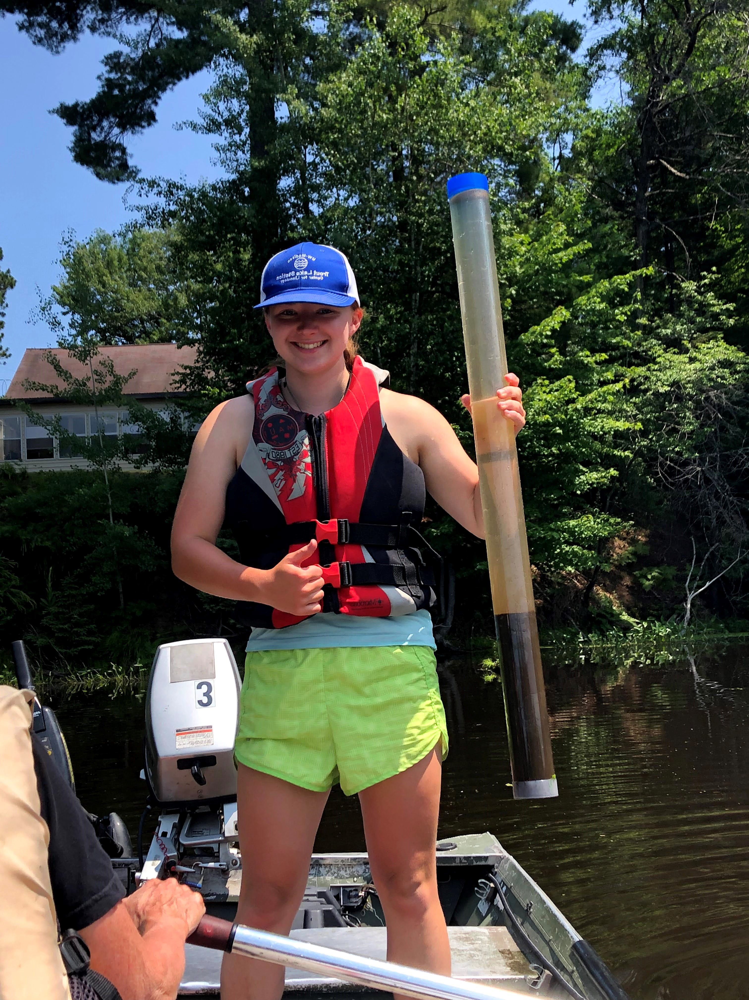
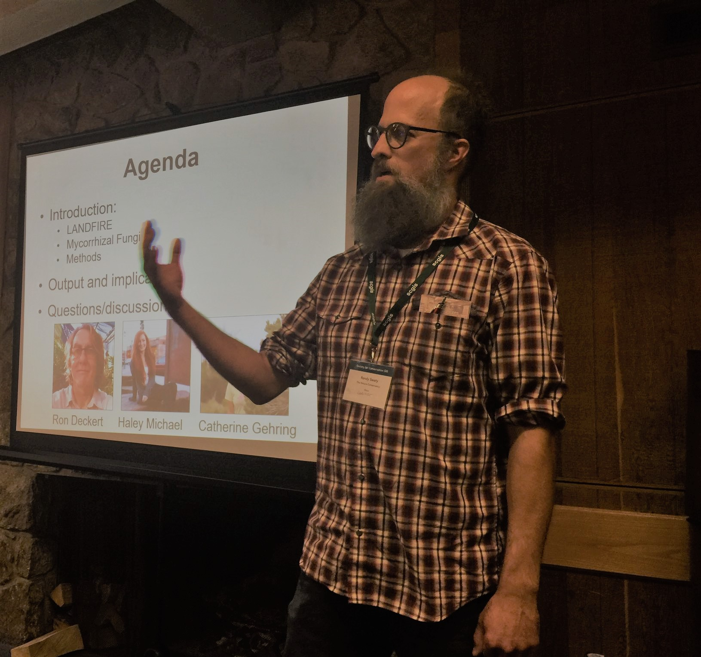

```{r setup, include=FALSE}
knitr::opts_chunk$set(echo = TRUE)
library(flexdashboard)
library(tidyverse)
```

```{r include=FALSE}
bps_sclass_practice <- read_csv("bps_sclass.csv")
nhheat <- read_csv("nh_heat.csv")
theme_set(theme_bw())
```


Background
=========================================

## Kowalski Analysis


```{r, echo=FALSE, out.width="100%"}
knitr::include_graphics("hardwood2.jpg")
```


```{r, echo=FALSE, out.width="100%"}
knitr::include_graphics("hardwood.jpg")
```


```{r, echo=FALSE, out.width="100%"}
knitr::include_graphics("outcrop.jpg")
```


Column {.sidebar}
-----------------------------------------------------------------------
<b><font  size="4em" color="#000000">What is LANDFIRE? And what did we do? </font></b>  

Conservation issues often transcend political boundaries, and require many datasets making conservation planning a challenge. Many freely available datasets are state-based, only covering one attribute of vegetation (e.g., type but not height) or are incompatible. In the United States the [LANDFIRE program](https://landfire.gov/) delivers over two dozen datasets that characterize vegetation, fire and fuel characteristics for all lands.  

**Using LANDFIRE data we:**

* Developed maps of Vermont's ecosystems past and present
* Identified potential areas of old-growth northern hardwoods
* Explored utility, and challenges of using LANDFIRE data


Past
=========================================

## Kowalski Analysis

```{r, echo=FALSE, out.width="100%"}
knitr::include_graphics("vermont_bps.jpg")
```
 


Column {.sidebar}
-----------------------------------------------------------------------
<b><font  size="4em" color="#000000">Precolonialization</font></b>  

This map is symbolized by the field, the Biophysical Setting (BpS) Name. It is ungrouped BpSs as delivered by LANDFIRE, so I didn't consolidate similar groups or change colors. These BpSs are the dominant ecosystems that would have been on the landscape just prior to European Settlement. Each BpS has a description, models of how disturbances and succession classes interact and spatial data. The spatial data is delivered as a raster with 30M x 30M pixels. There are roughly 900 BpSs in the lower 48. This BpS dataset was created by mapping dozens of abiotic factors then using regression models to label the pixels.

Symbolizing by BpS Name allows for a finer resolution than Group Vegetation with 27 values instead of 8 respectively. No changes were made to the color ramp so it is slightly hectic on its own with so many different colors. Going forward with this project and with other state or county wide midsize LANDFIRE projects I plan to adjust the color ramp, remove some of the lesser mapped types, and make a few adjustments for easier viewing. 


Present
=========================================

## Kowalski Analysis

```{r, echo=FALSE, out.width="80%", fig.align='center'}

```
 
 
<br>

***

<br>
 
```{r nhscls, echo=FALSE, message=FALSE, warning=FALSE, out.width="70%", fig.align='center'}

# need to make longer
bps_sclass_practice <- bps_sclass_practice %>%
  pivot_longer(
    cols = c(`Reference`, `Current`), 
    names_to = "refCur", 
    values_to = "Percent"
  )

bps_sclass_practice$Sclass <- factor(bps_sclass_practice$Sclass, levels = c(
  "Early Development Hardwood", 
  "Early Development, Mid-Tolerant Hardwood", 
  "Mid Development 1, closed canopy", 
  "Mid Development 2, closed canopy", 
  "Late Development",
  "UE", 
  "UN", 
  "Agriculture",
  "Urban",
  "Barren or Sparse"))

#factor(bps_sclass_practice$Sclass, levels = rev(levels(bps_sclass_practice$Sclass)))


ggplot(bps_sclass_practice, aes(fill=factor(refCur), y=Percent, x=Sclass)) + 
  geom_col(width = 0.8, position = position_dodge()) +
  coord_flip() +
  #facet_grid(. ~BpS) +
  scale_x_discrete(limits = rev(levels(bps_sclass_practice$Sclass))) +
  labs(
    title = "Succession Classes past and present for Vermont",
    subtitle = "Laurentian-Acadian Northern Hardwoods Forest",
    caption = "Late-development, closed canopy, tallest succession class not present in this BpS. \nData from landfire.gov.",
    x = "",
    y = "Percent")+
  theme_minimal(base_size = 14)+
  theme(plot.caption = element_text(hjust = 0, face= "italic"), #Default is hjust=1
        plot.title.position = "plot", #NEW parameter. Apply for subtitle too.
        plot.caption.position =  "plot") +
  scale_fill_manual(values = c("#3d4740", "#32a852" ), # present (grey), historical (green)
                    name = " ", 
                    labels = c("Present",
                               "Past"))

```


<br>

***

<br>

```{r, echo=FALSE, out.width="70%", fig.align='center'}


ggplot(nhheat,aes(x=evc, y=evh, fill = percent)) +
  geom_tile(color ='NA') +
  guides(fill=guide_legend(title="Percent of BpS \nper particular \ncombination")) +
  #scale_x_discrete(labels = function(x) paste0(x, "%")) +
  coord_cartesian(xlim=c(49,100), ylim=c(0, 22)) +
  labs(x="Canopy Cover %",
       y="Canopy Height (meters)",
       title="Canopy cover and height combinations",
       subtitle = "Northern Hardwood Forests of Vermont") +
  scale_fill_distiller(palette = "Greens", trans = "reverse") +
  theme_bw(base_size=14)+
 split(nhheat, cut(nhheat$evc, 2))
```


Column {.sidebar}
-----------------------------------------------------------------------
<b><font  size="4em" color="#000000">Current</font></b>  

**EVT Map**

LANDFIRE delivers many datasets that help land managers understand today’s landscape. Most recent data represents conditions as of 2016. In 2022 data representing 2019 will be delivered and refreshed every two years. These current data sets are used in management planning, research, and forest certification. 

Here I've mapped the Existing Vegetation Type (EVT) Group Name, a mid-level of coarseness within the EVT data set. Coarser symbology can be viewed under the EVT Group value field and finer through EVT Name. I adjusted the colors and consolidated lesser mapped group names for easier viewing. 

Here, we can visualize past data and present data. Next, let's bridge the gap between the two with some graphs.


**Vegetation Departure Graph**

I wondered how the historical amounts of succession classes compared to current succession classes for northern hardwoods specifically. To visualize this, I combined the modeled succession class amounts from the BpS description and the current succession classes from the current LANDFIRE Succession Class data and graphed them side by side in R. UN stands for uncharacteristic native which represents pixels that don't accurately represent the succession class. This could be odd canopy cover and tree height combinations like trees over 10M and canopy cover less than 60%. In the Great Lakes region this often represents heavy logging and/or beech bark disease. UE stands for uncharacterisic exotic like the presence of Japanese Knotweed.

Notice there was no Late Development northern hardwood mapped in 2016 despite it being the predominant class precolonization. We can also learn from this graph that there was a major over-representation of the Mid-Development 2 succession class, which has sugar maples, yellow birch and other northern hardwood species.


**Heat Chart**

The next heat chart depicts the height/cover combinations for the northern hardwoods in Vermont. Darker cells indicate more northern hardwoods in that combination. It is important to note the Canopy Cover axis that starts at 50% for better viewing purposes. This graph was made with a combined data set simliar to the prior graph methods.

From the last graph, it is evident that the mid-development class was a strength, but this heat chart depicts the distribution in greater detail through the cells with greater saturation. The blank spot on the right side of the graph represents the missing late development class. Heat charts are yet another helpful tool for representing class height and cover distribution.
    
    


Extrapolation
=========================================
## Kowalski Analysis


```{r, echo=FALSE, out.width="100%"}
knitr::include_graphics("potential_nh.jpg")
```
 

Column {.sidebar}
-----------------------------------------------------------------------
<b><font  size="4em" color="#000000">"Old Growth"</font></b>  

The term "old growth" at times can be politically charged and disputed with different classifications in different organizations. For the purposes of this presentation, I refer to the late development succession class of northern hardwood as old growth. In this map I took a stab at mapping potential (future) old growth forests by applying a simple ruleset. I basically mapped pixels that have northern hardwoods forests plus 70% or greater forest cover AND 20m or greater height. While old growth does not occur exclusively by these rules, it will more than likely present ideal conditions for potential old growth areas. Extrapolation on forest age such as this paired with anecdotal evidence and/or more indepth lidar presents the opportunity to spatially focus on older versus younger forests. 


More Methods & Authors
=========================================

## Kowalski Analysis

<br>

**Geographical Analysis**

All processing of LANDFIRE spatial data was conducted in ArcGIS Pro (Version 2.5, https://www.esri.com/en-us/arcgis/products/arcgis-pro/overview) and included:

* Exporting the Vermont state border from United States Cartographic Boundary file (20m, obtatined from http://www2.census.gov/geo/tiger/GENZ2014/shp/cb_2014_us_state_20m.zip)
* Clipping of all LANDFIRE datasets by the Vermont state border using the Clip Raster tool in the Data Management toolbox.
* Combining of the Biophysical Settings and Succession class datasets using the Combine tool in the Spatial Analyst toolbox.
* Map making, described in sidebars. 
* Attribute tables were exported as .csv files for wrangling and chart making

**Data wrangling and charts**

Data wrangling and charts were made with R (R Core Team, 2021, https://www.r-project.org/) within the R-Studio Integrated Design Environment (R Studio Team, 2021, http://www.rstudio.com/).

Code and input data available upon request.

<br>

**Authors**

Erin Matula: is graduating from [Northern Michigan University](https://nmu.edu/) in the spring of 2022 with a bachelors degree in Environmental Science. She will be attending graduate school at Trent University to study impacts of prescribed fire on boreal systems.  Erin was responsible for conceptualizing and implementing the dashboard, GIS analysis, data wrangling, chart making and writing. She completed this work as part of an internship with [The Nature Conservancy](https://www.nature.org/en-us/) and the [Conservation Data Lab](https://conservationdatalab.org/).

```{r, echo=FALSE, out.width="30%"}

```

<br>

Randy Swaty: is an ecologist with The Nature Conservancy's LANDFIRE team and cheerleader-in-cheif of the Conservation Data Lab.  Contributed GIS guidance, some R code and writing.
```{r, echo=FALSE, out.width="30%"}

```

<br>

Matt Van Grinsven: is an Associate Professor at Northern Michigan University.  Matt studies water quality and quantity, aquatic ecology, forest resources and more in the Great Lakes and Colorado Plateau regions.  Matt served as faculty advisor and mentor for Erin.

```{r, echo=FALSE, out.width="30%"}

```


**Acknowledgements**
We would like to thank the [Vermont Chapter of The Nature Conservancy](https://www.nature.org/en-us/about-us/where-we-work/united-states/vermont/) for the inspiration, and Colleen Matula (Erin's mom) for constant support. 


